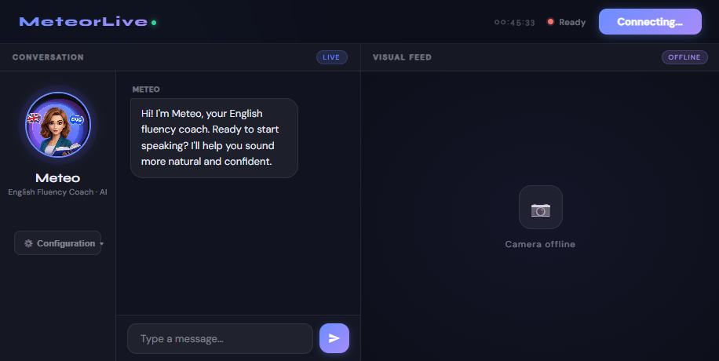
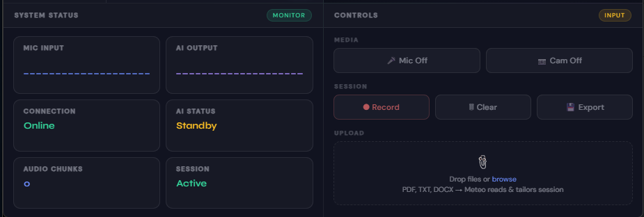

# MeteorLive 🌠

| Author |
|---|
| Moh. Khalifa |

**Real-time English Fluency Trainer powered by Gemini Live API**

MeteorLive is a full-stack AI coaching application built for the **Google Gemini Live Agent Challenge**. It pairs a FastAPI WebSocket backend with a single-page frontend to deliver live spoken English coaching through Gemini's native audio model — with barge-in interruption, real-time transcription, video feed, document upload, and session recording.


*Meteo coaching a live session with real-time transcription and camera feed*


*System Status panel showing MIC INPUT, AI OUTPUT, and session controls*

---

## Overview

MeteorLive simulates a private English fluency coach that lives in your browser. Unlike text-based tutors, Meteo listens and speaks back in real-time — correcting your pronunciation and grammar naturally mid-conversation. The agent demonstrates three core Live API capabilities:

1. **Multimodal input** — Meteo can hear your voice and see your camera feed simultaneously, enabling visual context (e.g., read a document you hold up, react to your facial expressions).
2. **Barge-in & natural turn-taking** — You can interrupt Meteo at any moment, just like a real conversation, with no awkward wait-your-turn delays.
3. **Adaptive coaching** — Upload a PDF, DOCX, or TXT and Meteo instantly tailors the session to your content — preparing you for a presentation, job interview, or specific vocabulary set.

The app requires **no build step** and runs entirely from a single Python process — making it easy for judges to spin up locally in under two minutes.

---

## Features

| Category | Details |
|---|---|
| **AI Persona** | *Meteo* — an English fluency coach that corrects pronunciation and grammar naturally |
| **Live Audio** | Bidirectional PCM16 streaming at 16 kHz via AudioWorklets |
| **Barge-In** | Interrupt Meteo mid-sentence to keep conversation natural |
| **Transcription** | Real-time transcription of both user speech and Meteo's responses |
| **Camera Feed** | Live JPEG video frames sent to Gemini for visual context |
| **Document Upload** | Upload PDF, DOCX, or TXT files — Meteo reads and tailors the session |
| **Session Recording** | Record mic + camera + Meteo audio into a timestamped `.webm` file |
| **Configuration UI** | Per-user API key, GCP Project ID, region, and model — stored in localStorage |
| **Multi-model** | Switch between Gemini 2.5 Flash Native Audio, 2.0 Flash Live, and more |

---

## Project Structure

```
meteor_live_production/
├── backend/
│   └── main.py              # FastAPI server — WebSocket /ws/live/{client_id}
├── static/
│   ├── index.html           # Single-page frontend (vanilla JS)
│   ├── capture.worklet.js   # AudioWorklet — mic capture (PCM16 @ 16 kHz)
│   └── playback.worklet.js  # AudioWorklet — Meteo audio playback (PCM16 @ 24 kHz)
├── screenshots/
│   ├── meteorlive-conversation.png   # Conversation panel screenshot
│   └── meteorlive-controls.png       # System status & controls screenshot
├── .env                     # API key (see setup below)
├── requirements.txt
└── README.md
```

---

## Quick Start

### Prerequisites

- Python 3.10+
- A [Gemini API key](https://aistudio.google.com/apikey) (free tier works)

### 1. Clone & install

```bash
git clone https://github.com/YOUR_USERNAME/meteorlive.git
cd meteor_live_production
pip install -r requirements.txt
```

### 2. Set your API key

Create a `.env` file in the project root:

```env
GEMINI_API_KEY=AIzaSy...your_key_here
```

Or export it directly:

```bash
export GEMINI_API_KEY=AIzaSy...your_key_here
```

> **No server key?** Leave `.env` empty — users can enter their own key in the in-app **Configuration** panel instead.

### 3. Run

```bash
python backend/main.py
```

Open **[http://localhost:9090](http://localhost:9090)** in your browser.

---

## Usage

1. Click **⚙️ Configuration** (under the avatar) to set your API key, model, or region before connecting
2. Click **Connect** to start a Gemini Live session
3. Allow microphone (and optionally camera) access
4. Speak naturally — Meteo responds with audio and transcription
5. *(Optionally)* Upload a document (PDF / DOCX / TXT) to have Meteo tailor the session to your content
6. *(Optionally)* Click **⏺ Record** to capture the full session — mic + camera + Meteo audio — as a `.webm` file

---

## Configuration Panel

The **Configuration** button in the sidebar opens a dropdown where each user can set:

| Field | Description |
|---|---|
| **Gemini API Key** | Personal key from [aistudio.google.com/apikey](https://aistudio.google.com/apikey) |
| **Project ID** | GCP project ID (required for Vertex AI / Cloud Run) |
| **Region** | Nearest GCP region (includes `me-central1` Doha) |
| **Model** | Live model variant to use for the session |

Settings are saved to `localStorage` and applied on the next **Connect**.

---

## WebSocket API

The backend exposes a single WebSocket endpoint:

```
ws://localhost:9090/ws/live/{client_id}
```

Optional query parameters override server defaults per-session:

| Parameter | Example |
|---|---|
| `api_key` | `?api_key=AIzaSy...` |
| `model` | `?model=models/gemini-2.0-flash-live-001` |
| `region` | `?region=me-central1` |

### Message types (client → server)

| `type` | Payload | Description |
|---|---|---|
| `audio` | base64 PCM16 | Raw mic audio chunk |
| `video` | base64 JPEG | Camera frame |
| `text` | string | Chat message or document content |
| `barge_in` | — | Interrupt Meteo's current response |

### Message types (server → client)

| `type` | Description |
|---|---|
| `audio` | Base64 PCM16 audio from Meteo |
| `output_transcription` | Meteo's speech as text |
| `input_transcription` | User's speech as text |
| `turn_complete` | Meteo finished speaking |
| `error` | Error message string |

---

## Requirements

```
fastapi
uvicorn[standard]
google-genai
python-dotenv
```

Install with:

```bash
pip install -r requirements.txt
```

---

## Deploying to Google Cloud Run

```bash
# Build and push container
gcloud builds submit --tag gcr.io/YOUR_PROJECT_ID/meteorlive

# Deploy
gcloud run deploy meteorlive \
  --image gcr.io/YOUR_PROJECT_ID/meteorlive \
  --platform managed \
  --region us-central1 \
  --allow-unauthenticated \
  --set-env-vars GEMINI_API_KEY=your_key
```

---

## Tech Stack

| Layer | Technology |
|---|---|
| Backend | Python · FastAPI · WebSocket |
| AI | Google Gemini Live API (`google-genai` SDK) |
| Audio | Web AudioWorklet — PCM16 capture & playback |
| Frontend | Vanilla JS · Single HTML file · No build step |
| Deployment | Google Cloud Run (recommended) |

---

## Hackathon

Built for the **[Google Gemini Live Agent Challenge](https://geminiliveagentchallenge.devpost.com/)** — Live Agents category.  
Submission deadline: **March 16, 2026 5:00 PM PDT**

---

## License

MIT
